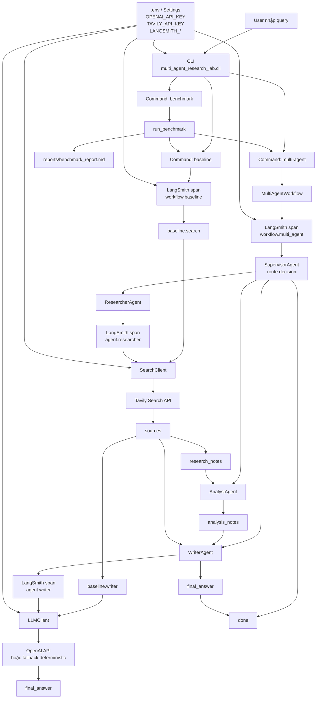
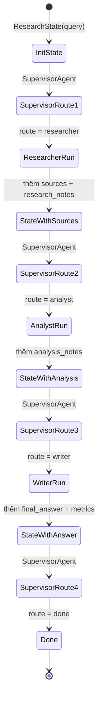

# Multi-Agent Research Lab

Repo này xây dựng một hệ thống nghiên cứu bằng AI agent. Người dùng nhập một câu hỏi nghiên cứu, hệ thống sẽ tìm kiếm tài liệu bằng Tavily, gọi LLM qua OpenAI, sau đó tạo câu trả lời cuối cùng có nguồn tham khảo. Dự án có hai chế độ chạy chính:

- `baseline`: một pipeline đơn giản, dùng search rồi viết câu trả lời.
- `multi-agent`: nhiều agent phối hợp theo vai trò Researcher, Analyst, Writer dưới sự điều phối của Supervisor.

Hệ thống có đo latency, token/cost ước tính, chất lượng đầu ra và hỗ trợ trace lên LangSmith.

## Kiến trúc tổng quan

```text
User Query
   |
   +-- baseline
   |      |
   |      +-- workflow.baseline
   |             |
   |             +-- baseline.search  -> Tavily Search
   |             +-- baseline.writer  -> OpenAI LLM
   |             +-- Final Answer
   |
   +-- multi-agent
          |
          +-- workflow.multi_agent
                 |
                 +-- Supervisor
                 |      |
                 |      +-- route -> Researcher
                 |      +-- route -> Analyst
                 |      +-- route -> Writer
                 |      +-- route -> done
                 |
                 +-- Researcher -> Tavily Search
                 +-- Analyst    -> phân tích claim, gap, insight
                 +-- Writer     -> viết câu trả lời cuối cùng bằng OpenAI LLM
                 +-- Final Answer
```

## Sơ đồ kiến trúc agent hiện tại

Sơ đồ dưới đây mô tả đúng kiến trúc hiện tại của source code. Khi xem trên GitHub, block Mermaid này sẽ được render thành diagram.



### Luồng state giữa các agent



## Kiến trúc agent

| Thành phần | Vai trò |
| --- | --- |
| `SupervisorAgent` | Điều phối luồng chạy, quyết định agent tiếp theo dựa trên trạng thái hiện tại, giới hạn số vòng lặp bằng `MAX_ITERATIONS`. |
| `ResearcherAgent` | Gọi `SearchClient` để tìm nguồn thật từ Tavily, lưu `sources` và `research_notes`. |
| `AnalystAgent` | Đọc kết quả research, rút ra claim chính, khoảng trống thông tin và đề xuất hướng viết. |
| `WriterAgent` | Tổng hợp query, nguồn và phân tích để tạo `final_answer`; nếu có OpenAI key thì gọi LLM thật. |
| `CriticAgent` | Agent kiểm tra/chấm điểm chất lượng, dùng cho đánh giá hoặc mở rộng workflow. |
| `BaselineResearchAgent` | Pipeline đơn giản để so sánh với multi-agent. |

Các agent dùng chung một state kiểu `ResearchState`, gồm các trường quan trọng:

- `query`: câu hỏi nghiên cứu đầu vào.
- `sources`: danh sách nguồn tìm được từ Tavily.
- `research_notes`: ghi chú nghiên cứu.
- `analysis_notes`: phân tích của Analyst.
- `final_answer`: câu trả lời cuối cùng.
- `route_history`: lịch sử route của Supervisor.
- `metrics`: latency, token, cost, chất lượng, số nguồn.
- `error_count`: số lỗi xảy ra trong workflow.

## Yêu cầu

- Python 3.11 trở lên.
- OpenAI API key để gọi LLM.
- Tavily API key để search thật.
- LangSmith API key nếu muốn bật tracing.

Runtime hiện tại không dùng mock search. Nếu không cấu hình Tavily, lệnh chạy thật sẽ báo lỗi. Mock/fake client chỉ dùng trong test.

LLM runtime sẽ ưu tiên gọi OpenAI khi có `OPENAI_API_KEY` và `USE_LIVE_PROVIDERS=true`. Nếu OpenAI lỗi hoặc chưa cấu hình, `LLMClient` có fallback deterministic để chương trình không sập trong môi trường học/lab. Tuy nhiên để benchmark cost và chất lượng thực tế, nên cấu hình OpenAI key thật.

## Clone và cài đặt

### Windows PowerShell

```powershell
git clone <repo-url>
cd phase2-day5-multi-agent-lab

python -m venv .venv
.\.venv\Scripts\Activate.ps1

pip install -e ".[dev,llm]"
Copy-Item .env.example .env
```

### macOS/Linux

```bash
git clone <repo-url>
cd phase2-day5-multi-agent-lab

python -m venv .venv
source .venv/bin/activate

pip install -e ".[dev,llm]"
cp .env.example .env
```

Sau đó mở file `.env` và điền key thật.

## Cấu hình `.env`

Ví dụ cấu hình tối thiểu:

```env
OPENAI_API_KEY=your_openai_api_key
OPENAI_MODEL=gpt-4o-mini
USE_LIVE_PROVIDERS=true

TAVILY_API_KEY=your_tavily_api_key

LANGSMITH_API_KEY=your_langsmith_api_key
LANGSMITH_TRACING=true
LANGSMITH_PROJECT=day15

LOG_LEVEL=INFO
MAX_ITERATIONS=6
TIMEOUT_SECONDS=60
```

Lưu ý:

- Không hard-code API key vào source code.
- Không commit file `.env`.
- Nếu `LANGSMITH_TRACING=false`, chương trình vẫn chạy nhưng không gửi trace lên LangSmith.
- Nếu `USE_LIVE_PROVIDERS=false`, runtime search thật sẽ không chạy vì dự án đã bỏ mock data ở luồng chính.

## Chạy chương trình

Nếu đã cài bằng `pip install -e ".[dev,llm]"`, thường có thể chạy trực tiếp bằng `python -m ...`. Nếu gặp lỗi `ModuleNotFoundError`, đặt thêm `PYTHONPATH=src`.

Sau khi cài editable, repo cũng cung cấp console command:

```powershell
malab --help
```

### Xem danh sách lệnh

```powershell
python -m multi_agent_research_lab.cli --help
```

### Chạy baseline

```powershell
$env:PYTHONPATH="src"
python -m multi_agent_research_lab.cli baseline --query "Research GraphRAG state-of-the-art and write a 500-word summary"
```

Hoặc dùng console command:

```powershell
malab baseline --query "Research GraphRAG state-of-the-art and write a 500-word summary"
```

Baseline sẽ tạo trace gốc tên `workflow.baseline` nếu bật LangSmith.

### Chạy multi-agent

```powershell
$env:PYTHONPATH="src"
python -m multi_agent_research_lab.cli multi-agent --query "Research GraphRAG state-of-the-art and write a 500-word summary"
```

Hoặc:

```powershell
malab multi-agent --query "Research GraphRAG state-of-the-art and write a 500-word summary"
```

Multi-agent sẽ tạo trace gốc tên `workflow.multi_agent`, bên trong có các span như `agent.supervisor`, `agent.researcher`, `agent.analyst`, `agent.writer`.

### Chạy benchmark

```powershell
$env:PYTHONPATH="src"
python -m multi_agent_research_lab.cli benchmark --query "Research GraphRAG state-of-the-art and write a 500-word summary"
```

Hoặc:

```powershell
malab benchmark --query "Research GraphRAG state-of-the-art and write a 500-word summary"
```

Benchmark chạy cả baseline và multi-agent, sau đó đo:

- Latency.
- Token input/output.
- Cost ước tính.
- Số nguồn tìm được.
- Điểm chất lượng.

Báo cáo benchmark nằm tại:

```text
reports/benchmark_report.md
```

Lưu ý với PowerShell: ký tự xuống dòng lệnh là backtick `` ` ``, không phải dấu `\` như bash. Cách an toàn nhất là chạy một dòng như các ví dụ ở trên.

## Chạy test và kiểm tra chất lượng code

Chạy lint:

```powershell
python -m ruff check src tests --no-cache
```

Chạy unit test:

```powershell
$env:PYTHONPATH="src"
$env:PYTHONDONTWRITEBYTECODE="1"
pytest -q -p no:cacheprovider
```

Chạy type check:

```powershell
python -m mypy src tests --no-incremental --no-sqlite-cache --show-error-codes
```

Test không gọi Tavily/OpenAI thật. Test dùng fake client để kiểm tra logic agent ổn định, nhanh và không tốn chi phí.

## LangSmith tracing

Để trace hiện trên LangSmith, cần có các biến sau trong `.env`:

```env
LANGSMITH_API_KEY=your_langsmith_api_key
LANGSMITH_TRACING=true
LANGSMITH_PROJECT=day15
```

Sau khi chạy CLI, vào LangSmith và mở đúng project theo `LANGSMITH_PROJECT`. Ví dụ nếu đặt `LANGSMITH_PROJECT=day15`, trace sẽ nằm trong project `day15`.

Các trace chính:

- Baseline: `workflow.baseline`.
- Multi-agent: `workflow.multi_agent`.

Nếu không thấy trace trên LangSmith, kiểm tra lần lượt:

- `.env` đã có `LANGSMITH_TRACING=true` chưa.
- `LANGSMITH_API_KEY` có đúng workspace/org LangSmith đang mở không.
- `LANGSMITH_PROJECT` có đúng project đang xem không.
- CLI có thực sự load `.env` không.
- Lệnh có chạy xong không, vì trace được flush sau khi span kết thúc.

## Cấu trúc thư mục

```text
.
+-- docs/
|   +-- design_template.md       # Tài liệu thiết kế hệ thống
|   +-- lab_guide.md             # Hướng dẫn lab
|
+-- reports/
|   +-- benchmark_report.md      # Báo cáo benchmark latency/cost/chất lượng
|
+-- src/
|   +-- multi_agent_research_lab/
|       +-- agents/              # Supervisor, Researcher, Analyst, Writer, Critic
|       +-- graph/               # Workflow multi-agent
|       +-- observability/       # LangSmith tracing
|       +-- services/            # LLMClient, SearchClient
|       +-- evaluation/          # Benchmark và quality metrics
|       +-- cli.py               # Entry point CLI
|
+-- tests/                       # Unit tests
+-- .env.example                 # Mẫu cấu hình môi trường
+-- README.md
```

## Trạng thái hiện tại

Đã hoàn thành:

- CLI cho `baseline`, `multi-agent`, `benchmark`.
- Search thật bằng Tavily qua `SearchClient`.
- LLM thật bằng OpenAI qua `LLMClient`.
- Workflow multi-agent có Supervisor, Researcher, Analyst, Writer.
- Trace LangSmith cho baseline và multi-agent.
- Benchmark có latency, token, cost và điểm chất lượng.
- Báo cáo benchmark tiếng Việt tại `reports/benchmark_report.md`.
- Unit test dùng fake client, không dùng mock data trong runtime chính.

Giới hạn hiện tại:

- Workflow hiện là custom sequential graph trong `graph/workflow.py`, chưa dùng trực tiếp package LangGraph. Nếu yêu cầu bài lab bắt buộc dùng LangGraph library, bước tiếp theo là port workflow hiện tại sang LangGraph `StateGraph`.

## Deliverables gợi ý khi nộp bài

- Source code repo.
- `reports/benchmark_report.md`.
- Screenshot LangSmith của trace `workflow.multi_agent`.
- Screenshot hoặc link trace `workflow.baseline` nếu cần so sánh.
- Tài liệu thiết kế trong `docs/design_template.md`.
- Ghi chú rõ hệ thống dùng Tavily search thật, OpenAI LLM thật, test dùng fake client để tránh tốn chi phí.
